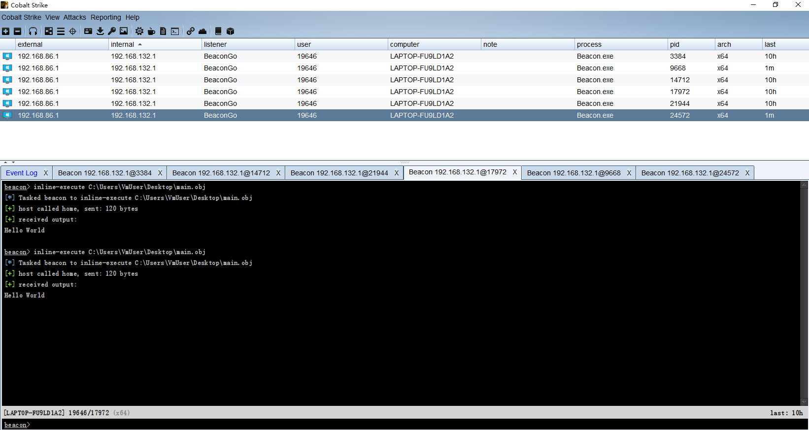
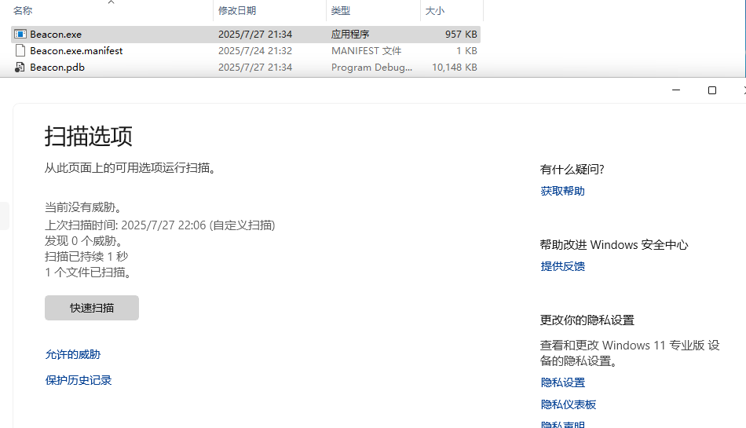

# 重构Beacon  With C 

此项目是适配CobaltStrike客户段的重构的Beacon。需要使用到提供的`beacon.profile`。

## 实现的功能

- [x] sleep
- [x] filebrowse
- [x] upload
- [x] drives
- [x] mkdir
- [x] pwd
- [x] getuid
- [x] ps
- [x] rm
- [x] download
- [ ] shell
- [x] exit
- [x] inline-execute

## 免杀性

至于免杀性，我也不想去测，但我相信，由于是重构的，在一定时间段内，过常见杀软是没问题的。本机带的Windows Defender。

