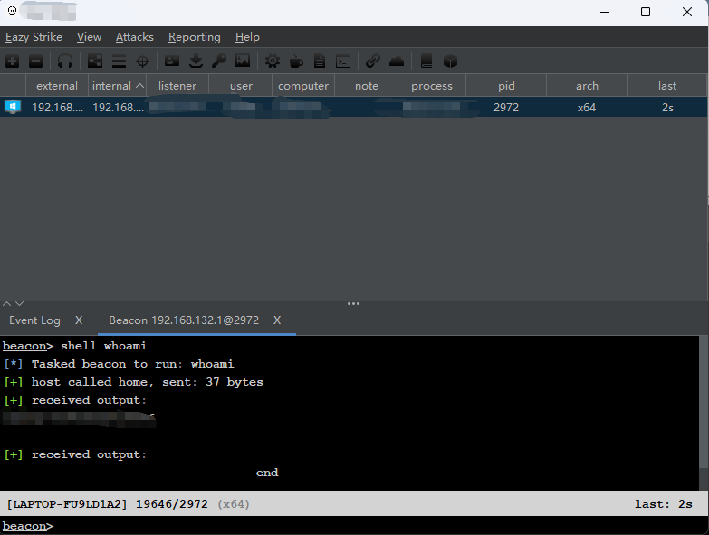

# 简单重构Beacon  With C 

此项目是适配CobaltStrike客户段的重构的Beacon。需要使用到提供的`beacon.profile`，此profile主要是对通信流量进行了一些处理（编码，prefix、suffix等）。

下面所有的情况都是针对CobaltStrike 4.4客户端。

## 实现的功能

- [x] sleep
- [x] filebrowse
- [x] upload
- [x] drives
- [x] mkdir
- [x] pwd
- [x] getuid
- [x] ps
- [x] rm
- [x] download
- [x] shell
- [x] exit
- [x] inline-execute
- [x] screenshot
- [x] keylogger
- [ ] hashdump
- [x] dllinject
- [x] getprivs
- [x] inject（注入 x64、x86都实现了）
- [x] setenv
- [x] cp
- [x] cd
- [x] mv
- [x] execute-assembly
- [x] jobs
- [x] jobkill

## 快速开始

- git clone下来

- `Config.c`中写你C2的地址，和监听器的端口

- RSA公钥换成你自己的，PEM格式，或者将提供的`.cobaltstrike.beacon_keys`文件作为你的私钥，替换到你的CobaltStrike客户端，或者参考这个项目 https://github.com/Slzdude/cs-scripts 获取RSA公钥

- 没有任何第三方库，Debug模式，x64编译即可

- 启动你的teamserver以及客户端，记得带上beacon.profile

- 双击编译后的程序，即可上线

## ToDo

- [x] 使用Beacon内部API进行数据解析

- [x] 当Beacon连接不到Server时，重复进行尝试，每次失败后，睡眠一段时间

- [ ] 对于一些交互式shell命令（time），造成命令等待输入阻塞问题

- [ ] 实现sleep jitter

- [ ] 隐藏windows terminal

- [ ] 错误日志重定位输出到文件

- [x] 对于Upload命令，当上传文件大于1MB时，CobaltStike Server会分段传输，然后循环发送剩余的数据，直至最后小于1MB左右的数据，对于的功能号为67

- [ ] 对于Upload命令，可以考虑使用线程来执行任务，不然主线程容易等待较长时间

## 其它

- 上传大文件（>几十MB）时，CobaltStrike客户端可能要读取解析文件，会造成长时间卡顿
- 不支持profile解析（一大痛点）
- 此Beacon中但凡涉及到进程注入的，都是注入到rundll32

- 此Beacon的注入方式有CreateRemoteThread以及SetThreadContext&ResumeThread，对于创建进程采用后者，注入到已有进程采用前者
- screenshot、keylogger等功能，都是使用CobaltStrike已有的Dll，若追求opsec，可以自己实现
- inject命令进行Beacon迁移，也是使用CobaltStrike自带的原始`beacon.dll`，可以自行修改CobaltStrike客户端进行Dll替换
- 仅支持x64，仅测试了Debug模式

## 免责声明

本仓库仅用于**学术研究、教育与防御能力评估**。
请在**授权且隔离的实验环境**中运行任何攻击相关测试脚本。禁止将本项目用于任何未授权的入侵测试或非法行为。作者对任何因误用本项目导致的法律后果不承担责任。

**仅供学习研究使用，严禁用于非法用途。**
