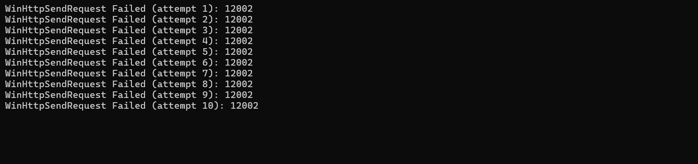
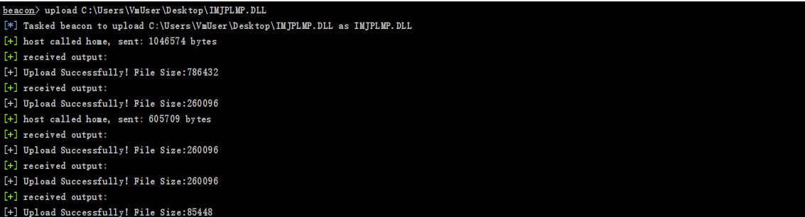

# 重构Beacon  With C 

此项目是适配CobaltStrike客户段的重构的Beacon。需要使用到提供的`beacon.profile`。

下面所有的情况都是针对CobaltStrike 4.4。

## 实现的功能

- [x] sleep
- [x] filebrowse
- [x] upload
- [x] drives
- [x] mkdir
- [x] pwd
- [x] getuid
- [x] ps
- [x] rm
- [x] download
- [x] shell
- [x] exit
- [x] inline-execute
- [ ] screenshot
- [ ] keylogger
- [ ] dllinject
- [ ] setenv

## Bug

开发过程中测试发现的Bug：

- [x] drivers命令崩溃
- [x] AES有些时候解密出错，解密数据大小不为16的倍数
- [x] shell执行calc时崩溃
- [x] download命令无法成功下载

## ToDo

- [x] 不使用buff_init、buffer_append、buffer_free函数，容易造成崩溃

- [x] 当Beacon连接不到Server时，重复进行尝试，每次失败后，睡眠一段时间

  

- [ ] 重写ps任务分支

- [ ] 重写filebrowse分支

- [ ] 对于一些交互式shell命令（time），造成命令等待输入阻塞问题

- [x] 对于Upload命令，当上传文件大于1MB时，CobaltStike Server会分段传输，然后循环发送剩余的数据，直至最后小于1MB左右的数据，对于的功能号为67

- [ ] 对于Upload命令，可以考虑使用线程来执行任务，不然主线程容易等待较长时间

## 其它

- 上传大文件（>几十MB）时，CobaltStrike客户端可能要读取解析文件，会造成长时间卡顿
