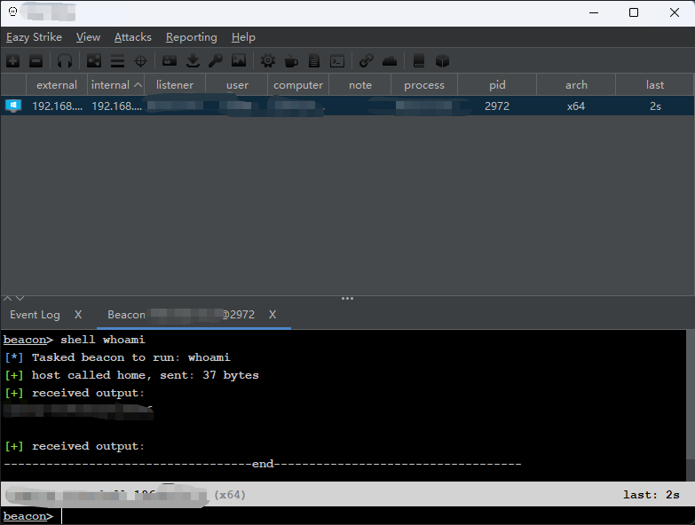

# 简单重构Beacon  With C 

此项目是适配CobaltStrike客户段的重构的Beacon（x64）。需要使用到提供的profile（beacon.profile），此profile主要是对通信流量进行了一些处理（编码，prefix、suffix等）。

以下所有的情况都是针对CobaltStrike 4.4客户端，在更高的CobaltStrike版本上没有进行测试。同时此项目的Beacon仅是一个简单的载荷，不及CobaltStrike的扩展性，但我觉得它具有一定的免杀性，如果可以，你能够进行一些功能的扩展以及防御的规避。



## 0x01.实现的功能

- [x] sleep
- [x] filebrowse
- [x] upload
- [x] drives
- [x] mkdir
- [x] pwd
- [x] getuid
- [x] ps
- [x] rm
- [x] download
- [x] shell
- [x] exit
- [x] inline-execute
- [x] screenshot
- [x] keylogger
- [x] hashdump
- [x] dllinject
- [x] getprivs
- [x] inject
- [x] setenv
- [x] cp
- [x] cd
- [x] mv
- [x] execute-assembly
- [x] jobs
- [x] jobkill

## 0x02.快速开始

- **克隆项目代码**

  ```bash
  git clone https://github.com/CDipper/Beacon
  ```

- **配置你的C2信息**

  在 `Config.c` 中填写你的 C2 服务器地址及 Listener 端口。

- **配置RSA公钥**

  在`Config.c`中将 RSA 公钥替换为你自己的（ PEM 格式），或者直接使用项目提供的`.cobaltstrike.beacon_keys` 文件作为私钥，并将其替换到 CobaltStrike 客户端中。

- **编译**

  Debug + x64 编译即可，没有任何第三方库。

- **运行**

  双击编译成功的程序，即可上线你的 CobaltStrike 客户端。

- **Teamserver启动**

  启动 teamserver 带上此项目提供的 profile 即可。


## 0x03.ToDo

- [x] 使用 Beacon 内部 API 进行数据解析等

- [x] 当 Beacon 连接不到 Server 时，重复进行尝试

- [ ] 对于一些交互式 shell 任务（time），造成命令等待输入阻塞子线程问题

- [x] 实现 sleep jitter。

- [ ] 隐藏 windows terminal

- [ ] 错误日志重定位输出到文件

- [x] 对于 Upload 任务，当上传文件大于 1MB 时，CobaltStike会分段传输，然后循环发送剩余的数据，直至最后小于 1MB 左右的数据，对于的功能号为67

- [ ] 对于 Upload 任务，可以考虑使用线程来执行任务，不然主线程容易造成阻塞

## 0x04.说明

- 上传大文件（>几十 MB）时，CobaltStrike 客户端可能要读取解析文件，会造成长时间卡顿。
- 不支持 profile 解析（一大痛点）。
- 此 Beacon 中但凡涉及到进程注入的，都是注入到 `rundll32.exe` 此进程中。

- 此 Beacon 的注入方式有 CreateRemoteThread 以及 SetThreadContext&ResumeThread，对于创建进程采用后者，注入到已有进程采用前者。可以修改当前的注入方法。
- screenshot、keylogger、hashdump功能，都是使用 CobaltStrike 已有的 DLL ，若追求 opsec，可研究这两个功能DLL。研究一下 CobaltStike 是如何 patch 命令管道的。
- inject 命令进行 Beacon 迁移时，也是使用 CobaltStrike 客户端自带的原始`beacon.dll`，可以自行修改 CobaltStrike 客户端进行 Dll 替换。
- 仅支持 x64，仅测试了 Debug 模式。

## 0x05.免责声明

- 本仓库仅用于**学术研究、教育与防御能力评估**。
- 请在**授权且隔离的实验环境**中运行任何攻击相关测试脚本。禁止将本项目用于任何未授权的入侵测试或非法行为。作者对任何因误用本项目导致的法律后果不承担责任。
- **仅供学习研究使用，严禁用于非法用途。** 
